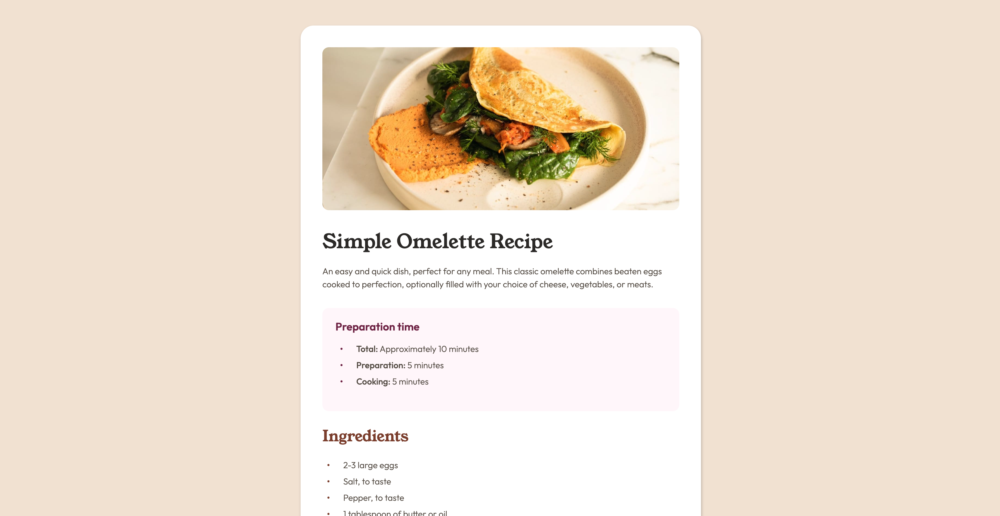

# Frontend Mentor - Recipe page solution

This is a solution to the [Recipe page challenge on Frontend Mentor](https://www.frontendmentor.io/challenges/recipe-page-KiTsR8QQKm). Frontend Mentor challenges help you improve your coding skills by building realistic projects.

## Table of contents

- [Overview](#overview)
  - [Screenshot](#screenshot)
  - [Links](#links)
- [My process](#my-process)
  - [Built with](#built-with)
  - [What I learned](#what-i-learned)
  - [Useful resources](#useful-resources)
- [Author](#author)

## Overview

### Screenshot



### Links

- Solution URL: [https://github.com/wideirp/recipe-page/](https://github.com/wideirp/recipe-page/)
- Live Site URL: [https://wideirp.github.io/recipe-page/](https://wideirp.github.io/recipe-page/)

## My process

### Built with

- Semantic HTML5 markup
- CSS custom properties
- Flexbox
- CSS tables
- Mobile-first workflow

### What I learned

Custom list styles

```css
ul {
  list-style: none;
  padding: 0;
}

/* style this element for the bullets */
li::before {
  content: "x";
}
```

### Useful resources

- [Custom List Styling Codepen](https://codepen.io/web-dot-dev/pen/OJvwZRM)

## Author

- Website - [wideirp](https://wideirp.github.io/)
- Frontend Mentor - [@wideirp](https://www.frontendmentor.io/profile/wideirp)
- Twitter - [@w1d31rp](https://www.twitter.com/w1d31rp)
